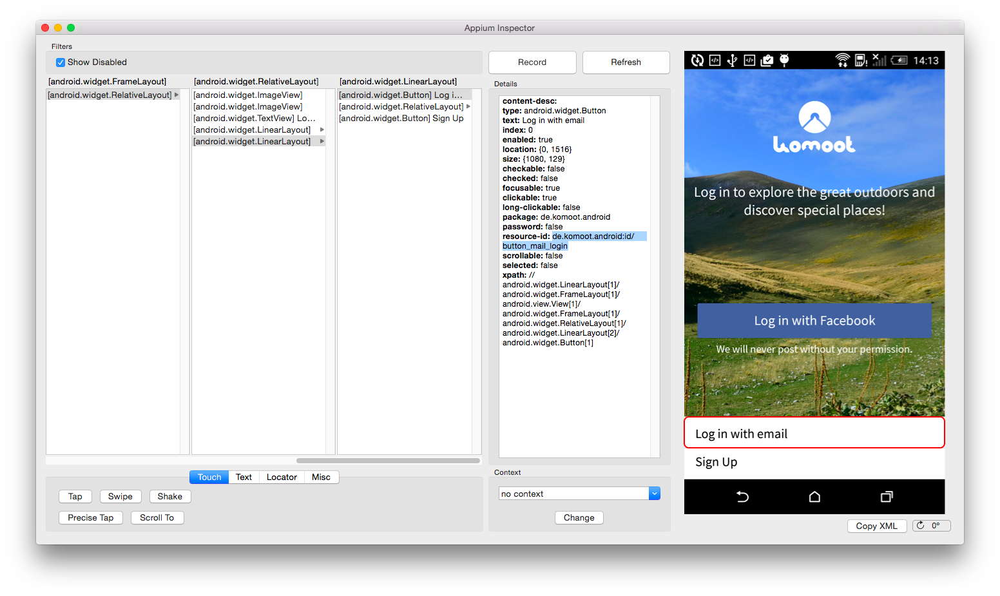
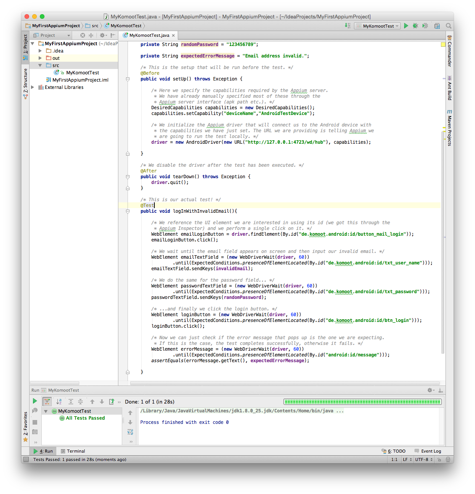

# Appium Testing on Physical Android Devices on OS X
Appium supports Android testing on Windows, OS X and Linux. This tutorial will help you set up Appium on OS X and run your first test. As an example we will be using the Komoot app which will run on a local Android device. For the purpose of this demonstration we will be writing tests in the Java programming language.

## What you will need
* Android SDK with API 17 or higher;
* The [IntelliJ IDEA IDE](https://www.jetbrains.com/idea/download/) (the free Community Edition is sufficient), or the [Eclipse IDE](https://www.eclipse.org/downloads/) (Java Developer Edition, also free) if you prefer;
* [Selenium Standalone Server](http://www.seleniumhq.org/download/) and [Appium Java Client](https://github.com/appium/java-client) JAR files;
* An Android device connected and recognized by your machine, with [USB debugging enabled](http://developer.android.com/tools/device.html#setting-up).

Once you have made sure you have everything you need, you must download and install Appium for your OS of choice, be it [OS X](https://bitbucket.org/appium/appium.app/downloads/appium-1.4.0.dmg),
[Windows](https://github.com/appium/appium-dot-exe) or [Linux]().

Once you run Appium, you should be confronted with a screen that looks more or less like this:

What you have in front of you is the Appium server. This piece of software will allow us to communicate with our device, be it local or remote (in our case the device is sitting right next to our machine).

### Testing on physical Android devices

First of all, you need to navigate to the Appium Android settings by clicking the Android icon on the top. Don't be intimidated by the amount of options that pop up, you won't need to fill in all the forms. Remember to also check the round button just below the icon to make sure you are targeting the right platform.

The first thing you need to do is point the Appium server to the APK file that you want to test. Simply check the "App Path" box and paste the path to the APK file in the text field, or navigate to it by clicking on "Choose".

Next, move a little further down the screen until you find the "Device Name" field, under "Capabilities". Check the box and insert a name for the device you want to test on. Although you can insert whatever name you like, this step is mandatory.

Lastly, you will need to provide Appium the path to your Android SDK folder. In case you did not install the SDK on its own, but as a part of the Android Studio bundle, you can get the path to this folder directly in Android Studio. Just navigate to File -> Project Structure -> SDK Location and copy the displayed string. If you installed the SDK without Android Studio, you just need to remember the path in which you unpacked it.

You will need to insert the path into the field labelled as "SDK Path". To do so, navigate to the "Advanced" tab, where you will see the "Android SDK Path" field. Just check the box, insert the path and you are done. You will need to check yet another checkbox, next to the label "SDK Path", and insert the path to your SDK in the text field. We can now go back to the main server screen by clicking the Android icon once more.

You are now ready to start the server. Close the Android settings screen and select the "play" button on Windows or the "Launch" button on OS X. You should see some information being printed on the Appium terminal. After a couple of seconds you can click on the button with a lens icon, which will open up the Appium Inspector. At this point the app will be installed and launched on your device.

The purpose of the Inspector is to allow you to reference the UI elements of the app you are testing so that you can interact with them.

For our example we will be using the Komoot app. You can use any other app and the testing process will follow the principles shown in this guide.

First we will click on the "Log in with email" button, and when the next screen pops up we will insert an invalid (uncorrectly formatted) email address in the email field, fill the password field with some random password and click the "Log in" button. What we will be expecting is an error message telling us the email address we have provided is invalid.

We start off in the Inspector by selecting and navigating through a series of layouts until we get to select our button. Every time you select an element the program will show you a series of attributes belonging to it. We can use some of these attributes to reference this element.

In this case we will be referencing our "Log in with email" button by its id. Put it on the side for the moment, we will need it soon.

Next, open up your IDE and create a new project (can be either in [Eclipse](http://pages.cs.wisc.edu/~cs302/labs/EclipseTutorial/Step_02.html) or [IDEA](https://www.jetbrains.com/idea/help/creating-and-running-your-first-java-application.html#create_project) . In this project, create a new class (here's how to do it in [IDEA](https://www.jetbrains.com/idea/help/creating-and-running-your-first-java-application.html#create_class) and [Eclipse](http://help.eclipse.org/luna/index.jsp?topic=%2Forg.eclipse.jdt.doc.user%2FgettingStarted%2Fqs-9.htm)). This is where we will be writing our tests.

Now you must import the jars we previously downloaded into the project. To do this

* in Eclipse, just right click on you project in the Package Explorer and select _Properties_, then select _Java Build Path_ and then click on _Add Eternal JARs_. Now select the Appium Java Client and the Selenium Server JARs and add them to the project;

* in IDEA, navigate to _File_ -> _Project Structure_, here you will find _Project Settings_ category, and under that  _Libraries_. Click the plus sign and select _Java_. Now browse to the folder where you downloaded the JARs, select the first one and add it, then repeat the procedure for the second one. Now click _OK_ and you are good to go.

Once this is done, we have all we need to write the code that will run our tests. First, let's set up Appium and see it everything runs as expected. This is what a program that launches the Komoot app and clicks on the "Login with email" button looks like:

    import io.appium.java_client.AppiumDriver;
    import io.appium.java_client.android.AndroidDriver;

    import java.net.URL;

    import org.junit.After;
    import org.junit.Before;
    import org.junit.Test;
    import org.openqa.selenium.By;
    import org.openqa.selenium.WebElement;
    import org.openqa.selenium.remote.DesiredCapabilities;
    import org.openqa.selenium.support.ui.ExpectedConditions;
    import org.openqa.selenium.support.ui.WebDriverWait;

    public class KomootTest {

    	/* This is the key piece of our test, since it allows us to
    	 * connect to the device we will be running the app onto.*/
    	private AppiumDriver driver;

    	private String invalidEmail = "abcdefg";
    	private String randomPassword = "123456789";

    	/* This is the setup that will be run before the test. */
        @Before
        public void setUp() throws Exception {

        	/* Here we specify the capabilities required by the Appium server.
        	 * We have already manually specified most of these through the
        	 * Appium server interface (apk path etc.). */
            DesiredCapabilities capabilities = new DesiredCapabilities();
            capabilities.setCapability("deviceName","AndroidTestDevice");

            /* We initialize the Appium driver that will connect us to the Android device with
             * the capabilities we have just set. The URL we are providing is telling Appium we
             * are going to run the test locally. */
            driver = new AndroidDriver(new URL("http://127.0.0.1:4723/wd/hub"), capabilities);

        }

        /* We disable the driver after the test has been executed. */
        @After
        public void tearDown() throws Exception {
            driver.quit();
        }

        /* This is... almost a test! */
        @Test
        public void logInWithInvalidEmail(){

        	/* We reference the UI element we are interested in using its id (we got this through the
        	 * Appium Inspector) and we perform a single click on it. */
        	WebElement emailLoginButton = driver.findElement(By.id("de.komoot.android:id/button_mail_login"));
            emailLoginButton.click();

        }

    }

Save the project, open up the Appium server, click on the "Launch" button (on Windows this has a symbol on it which looks like a "play" button). You should see some messages appear in the Appium server log confirming that the launch has been successful, and that the server is now on standby, ready to receive connections.

Our connection will come from the code we have just written. Go back to Eclipse, run the project and wait for the magic to happen. If everything went as expected, you should see the app pop up on your device and the "Login with email" button being pressed.

While this is not a test per-se, we are already seeing some automation.

We can easily improve our logInWithEmail method by adding some simple operations:

    /* This is our first test! */
    @Test
    public void logInWithInvalidEmail(){

      /* We reference the UI element we are interested in using its id (we got this through the
       * Appium Inspector) and we perform a single click on it. */
      WebElement emailLoginButton = driver.findElement(By.id("de.komoot.android:id/button_mail_login"));
        emailLoginButton.click();

      /* We wait until the email field appears on screen and then input our invalid email. */
      WebElement emailTextField = (new WebDriverWait(driver, 60))
          .until(ExpectedConditions.presenceOfElementLocated(By.id("de.komoot.android:id/txt_user_name")));
      emailTextField.sendKeys(invalidEmail);

      /* We do the same for the password field... */
      WebElement passwordTextField = (new WebDriverWait(driver, 60))
          .until(ExpectedConditions.presenceOfElementLocated(By.id("de.komoot.android:id/txt_password")));
      passwordTextField.sendKeys(randomPassword);

      /* ...and finally we click the login button. */
      WebElement loginButton = (new WebDriverWait(driver, 60))
    .until(ExpectedConditions.presenceOfElementLocated(By.id("de.komoot.android:id/btn_login")));
      loginButton.click();

      /* Now we can just check if the error message that pops up is the one we are expecting.
       * If this is the case, the test completes successfully, otherwise it fails. */
      WebElement errorMessage = (new WebDriverWait(driver, 60))
  			.until(ExpectedConditions.presenceOfElementLocated(By.id("android:id/message")));
      assertEquals(errorMessage.getText(), expectedErrorMessage);

    }

The IDs you see in this last snippet belong to UI elements which are not located in the first screen that our app is showing. To get these simply navigate your app from your device while the Inspector is open until the desired UI element is in view. Now go back to the Inspector, which will still be showing the initial screen, and click the _Refresh_ button. This will update the Inspector view loading the elements which are currently shown on the screen of the device, which you can now reference.

Rememeber to define a new constant in which you store the expected error message, in our case "Email address invalid." and to import org.junit.Assert.assertEquals

Unless something went wrong along the way, our test should succeed and the IDE should report this by showing a green bar somewhere in its main window. If that is the case, congratulations! You have run your first automated test using Appium!
